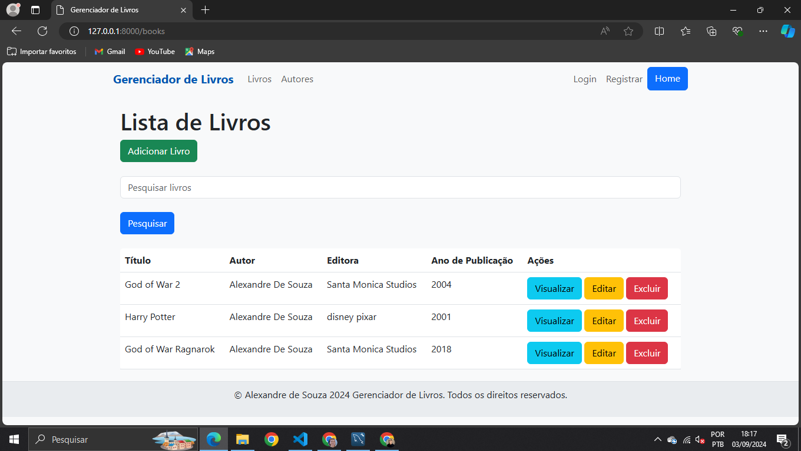
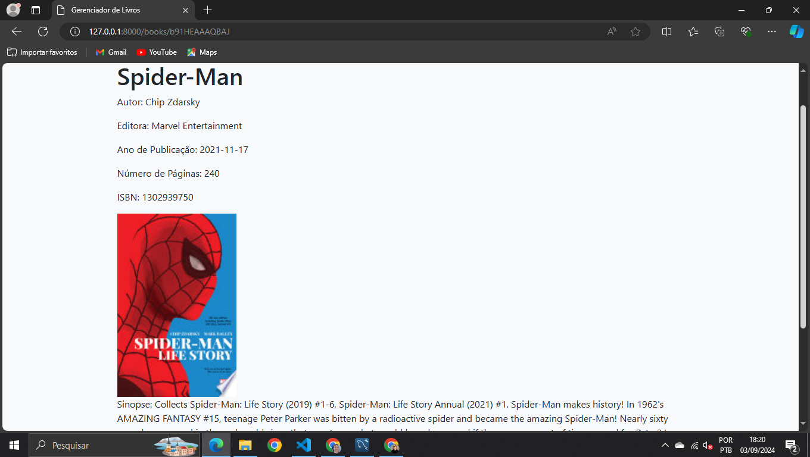
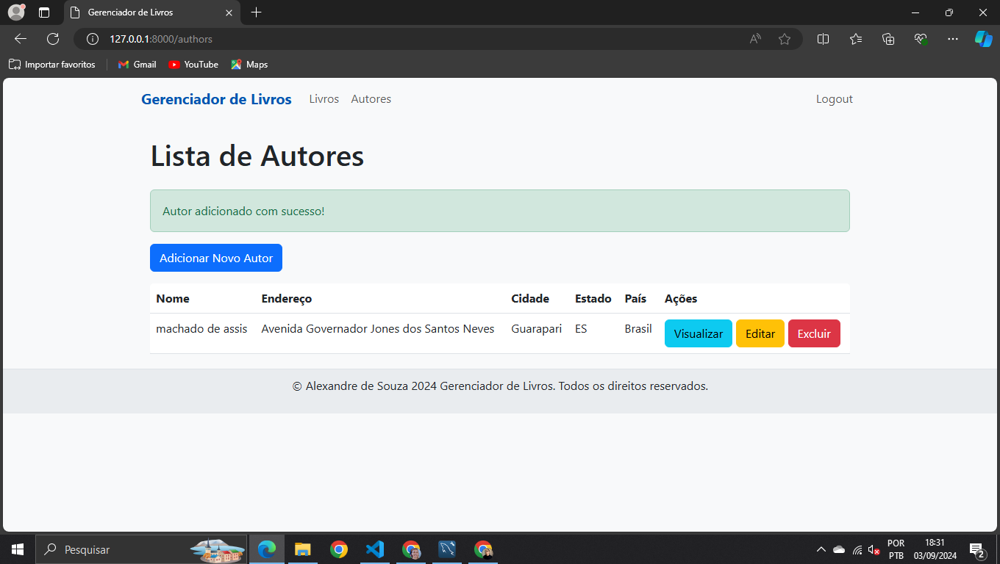
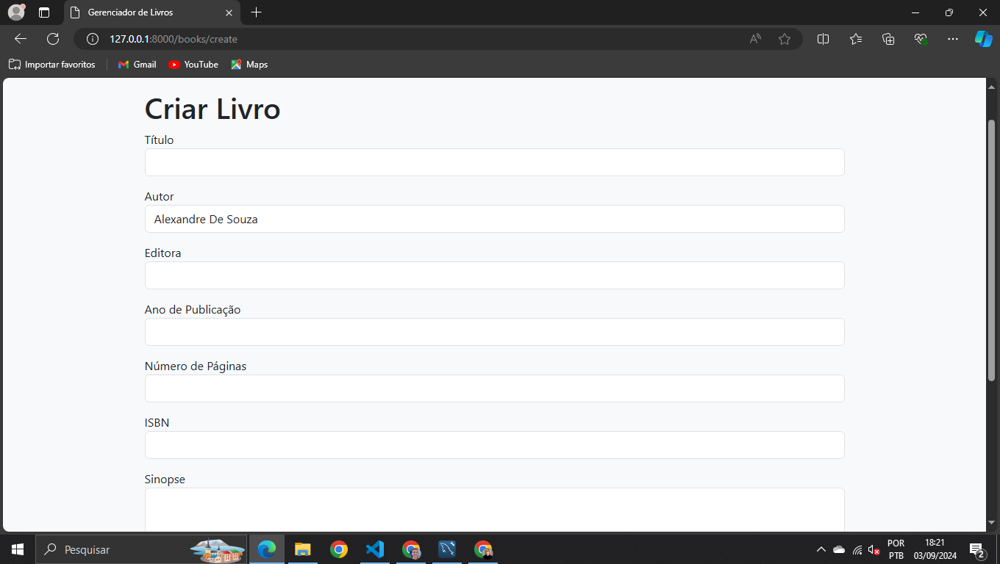

# Gerenciador de Livros

## Visão Geral

Este projeto é um gerenciador de livros desenvolvido como parte de um teste técnico para uma vaga de desenvolvedor full stack júnior PHP. O aplicativo é construído usando o framework Laravel e oferece integração com o Google Books para permitir pesquisas detalhadas sobre livros. Além disso, possui integração com o AWS S3 para upload e visualização de capas de livros e arquivos PDF.

## Funcionalidades Principais

### Usuários Anônimos

-   _Listagem de Livros_: Usuários não autenticados podem visualizar uma lista de todos os livros disponíveis na plataforma.





-   _Pesquisa de Livros_: Permite a busca por livros através do nome do livro, e do ISBN do livro atraves de um Endpoint como especificado no e-mail do teste, se o livro não for encontrado, você recebe uma view dizendo que o livro não foi encontrado, e também da pra fazer a pesquisa pelo nome do Autor, quando for pesquisado pelo nome do Autor aparece todos os livros que esse Autor escreveu;


-   _Detalhes do Livro_: Os detalhes de cada livro incluem título, sinopse, quantidade de páginas, ISBN, autor, editora, capa do livro, e um link para download do PDF se o livro for cadastrado na plataforma (e não através do Google Books).




### Usuários Cadastrados (Editoras)

-   _Gerenciamento de Autores_: Usuários cadastrados podem criar, editar e excluir autores.




-   _Gerenciamento de Livros_: Usuários cadastrados podem criar, editar e excluir livros associados aos autores que eles criaram.
-      



-   _Upload de Arquivos_: Os usuários podem fazer upload de capas de livros e arquivos PDF para o AWS S3, que serão armazenados e acessíveis através de URLs públicas.

## Integrações

### Google Books API

-   A integração com o Google Books permite que o sistema realize buscas mais abrangentes de livros, retornando informações detalhadas como título, autor, editora, sinopse, e outras informações bibliográficas.

### AWS S3

-   _Upload de Arquivos_: O AWS S3 é usado para armazenar as capas dos livros e os arquivos PDF. Os arquivos são carregados através do formulário de upload no sistema e são armazenados de forma segura no bucket do S3 configurado.
-   _Acesso Público_: Após o upload, as capas dos livros e os arquivos PDF são disponibilizados via URLs públicas, facilitando a visualização e o download.

## Requisitos

-   PHP 8.2+
-   Laravel 10.x
-   Composer
-   Banco de Dados MySQL
-   Conta AWS S3
-   Google Books API Key

## Instalação

1. **Clone o Repositório**

```bash
git clone https://github.com/XANDRAO/gerenciador-de-livros.git
cd gerenciador-de-livros
```

2. Instale as Dependências

```bash
composer install
```

3. Configure o Arquivo .env

-   Copie o arquivo .env.example para .env e configure os detalhes do banco de dados, Google Books API, e AWS S3.

4. Gere a Chave da Aplicação

```bash
php artisan key:generate
```

5. Execute as Migrações e Seeders

```bash
php artisan migrate
```

6. Inicie o Servidor

```bash
php artisan serve
```
